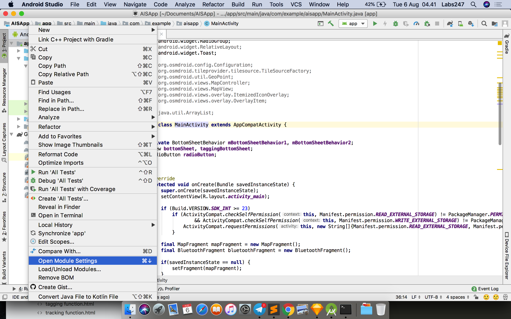
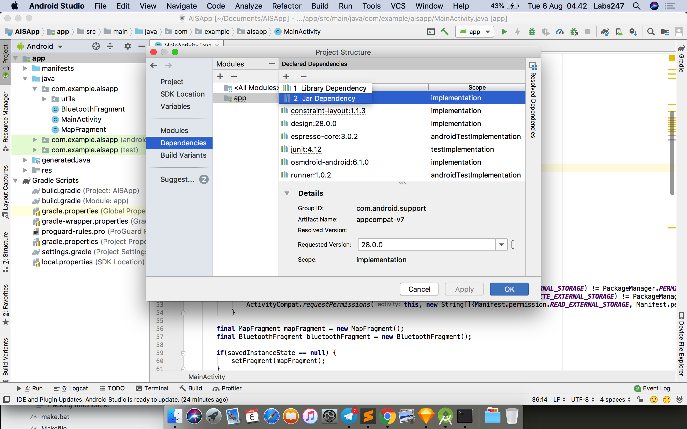
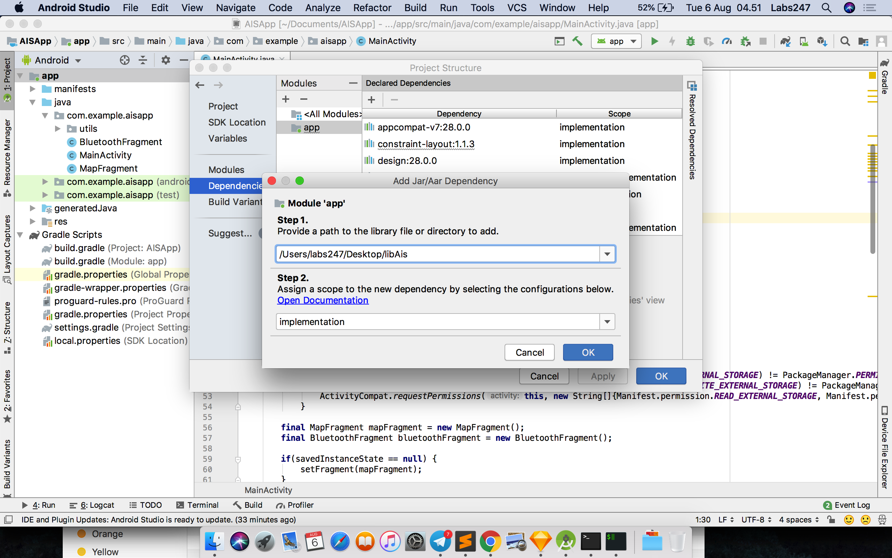

.. AIS Connector Library documentation master file, created by
   sphinx-quickstart on Wed Jul 31 09:53:10 2019.
   You can adapt this file completely to your liking, but it should at least
   contain the root `toctree` directive.

Implementation
=================================================

Follow these steps to implement AIS Connector Library in your android app project.

**Add module to android project**

1. Open your project in Android Studio. Right click on your project and choose **Open Module Setting**

2. Inside project Structure panel, choose **Depedencies** . Inside Declare Depedencies section, click icon **plus (+)** and chosee **JAR Depedency**. 

3. Inside Add Jar/Aar Depedency panel, enter path of AIC Connector Libraray, for example /Users/labs247/Desktop/libAis.

